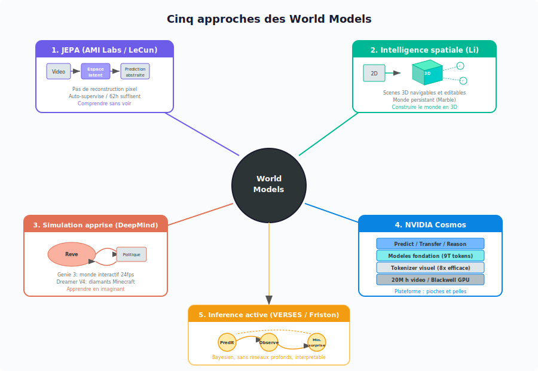
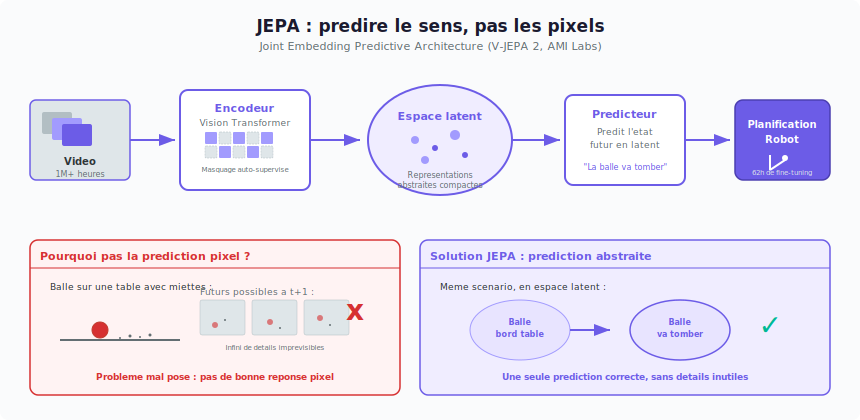
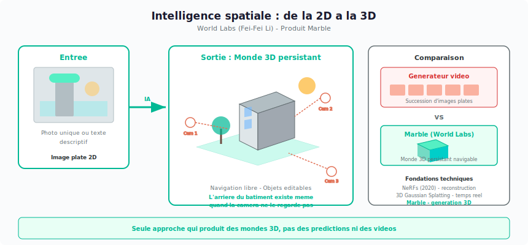
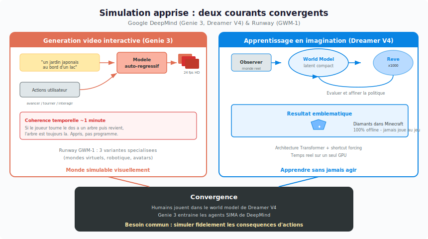
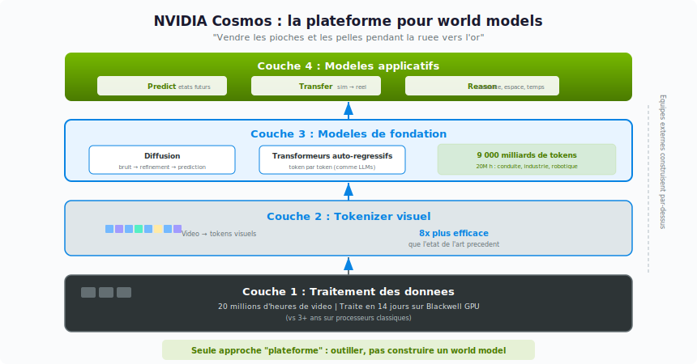
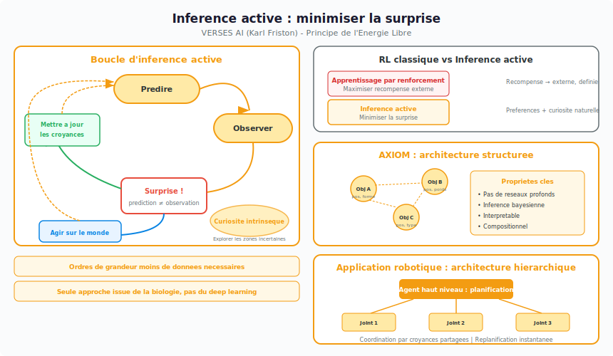

# World models : cinq approches pour apprendre aux machines à comprendre la réalité

En quelques semaines, deux startups ont levé chacune plus d'un milliard de dollars sur le même pari : les **modèles du monde**, ou *world models*. [AMI Labs](https://amilabs.xyz/), fondée par Yann LeCun (Meta AI), a réuni 1,03 milliard. [World Labs](https://www.worldlabs.ai/), fondée par Fei-Fei Li (Stanford), en avait levé 1 milliard peu avant.

L'enjeu est simple à formuler. Aujourd'hui, les IA les plus avancées excellent à manipuler du texte, des images et du code, mais elles n'ont aucune compréhension du monde physique. Elles ne savent pas qu'un verre lâché va tomber, qu'une porte doit être poussée pour s'ouvrir, ou qu'un objet caché derrière un mur continue d'exister. Un enfant de deux ans le sait. Pas GPT, pas Gemini, pas Claude.

Un **world model** (modèle du monde) vise à combler ce manque. L'idée : donner à une machine une sorte de simulateur interne de la réalité, capable de représenter comment les objets bougent, interagissent et persistent, puis d'utiliser ce simulateur pour anticiper ce qui va se passer ou pour décider quoi faire.

Le concept n'est pas nouveau. Les neuroscientifiques pensent depuis longtemps que le cerveau humain fonctionne en partie de cette façon, en maintenant en permanence un « modèle » du monde extérieur qu'il met à jour en temps réel. Ce qui est nouveau, c'est que plusieurs équipes pensent désormais pouvoir construire quelque chose d'équivalent à l'échelle industrielle.

Le problème, c'est que personne ne s'accorde sur la bonne méthode. Voici cinq approches, fondamentalement différentes, qui coexistent aujourd'hui.

---

## Vue d'ensemble : cinq philosophies, cinq paris

Avant d'entrer dans le détail de chaque approche, voici un résumé comparé.

  
   
  <em>Figure 1 — Les cinq grandes approches des world models et leurs philosophies distinctes.</em>

### 1. JEPA (AMI Labs, Yann LeCun)

- **Motivation :** prédire les pixels du futur est un objectif mal posé, car le monde est trop imprévisible à l'échelle du détail.
- **Ce que ça résout :** comprendre la physique à un niveau abstrait, réutilisable avec très peu de données spécialisées (62 heures de vidéo robotique suffisent).
- **Atouts :** apprentissage auto-supervisé, efficacité en données remarquable.
- **Faiblesses :** aucune sortie visuelle exploitable ; produits commerciaux à plusieurs années de distance.
- **Ce qui le distingue :** seule approche qui renonce entièrement à travailler dans l'espace des pixels.

### 2. Intelligence spatiale (World Labs, Fei-Fei Li)

- **Motivation :** comprendre le monde exige d'en reconstruire la structure tridimensionnelle, pas seulement de prédire ce qui va s'y passer.
- **Ce que ça résout :** générer des scènes 3D complètes, navigables et éditables à partir d'entrées simples.
- **Atouts :** véritables environnements 3D persistants, exportables pour la création ou la simulation.
- **Faiblesses :** scènes statiques (pas de dynamique temporelle) ; plausibilité physique encore fragile.
- **Ce qui le distingue :** seule approche qui produit des mondes en trois dimensions, et non des prédictions ou des vidéos.

### 3. Simulation apprise (Google DeepMind, Runway)

- **Motivation :** entraîner une IA dans le monde réel est lent, coûteux et parfois dangereux.
- **Ce que ça résout :** construire des simulateurs réalistes entièrement appris depuis la vidéo, dans lesquels des agents s'exercent « en rêvant ».
- **Atouts :** résultats spectaculaires (Dreamer V4 obtient des diamants dans Minecraft par pure imagination) ; convergence entre génération vidéo et apprentissage par renforcement.
- **Faiblesses :** cohérence limitée à environ une minute ; question ouverte sur la compréhension réelle de la physique.
- **Ce qui le distingue :** seule approche qui fusionne génération vidéo interactive et apprentissage par renforcement.

### 4. NVIDIA Cosmos

- **Motivation :** construire un world model depuis zéro est hors de portée de la plupart des équipes.
- **Ce que ça résout :** fournir la pile complète, du traitement de 20 millions d'heures de vidéo au déploiement en production.
- **Atouts :** échelle de données et de calcul inégalée ; tokenizer visuel 8 fois plus efficace que l'état de l'art précédent.
- **Faiblesses :** dépendance forte à l'écosystème NVIDIA.
- **Ce qui le distingue :** seule approche de type « plateforme », qui outille ceux qui construisent des world models sans en construire un elle-même.

### 5. Inférence active (VERSES AI, Karl Friston)

- **Motivation :** l'intelligence ne consiste pas à maximiser une récompense, mais à minimiser la surprise.
- **Ce que ça résout :** proposer un cadre unifié pour la perception, l'action et l'exploration, issu de la neuroscience computationnelle.
- **Atouts :** système interprétable, compositionnel, extrêmement économe en données.
- **Faiblesses :** pas encore éprouvé à grande échelle ; écosystème réduit.
- **Ce qui le distingue :** seule approche qui ne repose pas sur des réseaux de neurones profonds, et seule issue d'une théorie biologique de l'intelligence.

---

## 1. JEPA : comprendre le monde sans en reconstruire chaque détail

**Représentants :** [AMI Labs](https://amilabs.xyz/) (Yann LeCun), V-JEPA 2

  
   
  <em>Figure 2 — JEPA compresse la vidéo en représentations abstraites et prédit dans l'espace latent, évitant le problème insoluble de la prédiction pixel par pixel.</em>

### Le problème de départ

La plupart des modèles d'IA qui travaillent sur la vidéo fonctionnent de la même façon : on leur montre une scène, et ils essaient de prédire l'image suivante, pixel par pixel. Pour chaque point de l'image, le modèle doit décider de sa couleur exacte, de sa luminosité, de sa texture.

Yann LeCun, l'un des pères du deep learning et prix Turing 2018, affirme depuis des années que cette approche est vouée à l'échec pour comprendre la physique. Sa raison est intuitive : dans le monde réel, une infinité de futurs sont possibles à l'échelle du détail. Si une balle roule sur une table couverte de miettes, la position exacte de chaque miette à l'image suivante est essentiellement aléatoire. Forcer un modèle à prédire ces détails, c'est lui demander de résoudre un problème qui n'a pas de bonne réponse.

### L'idée clé : prédire le sens, pas les pixels

JEPA (*Joint Embedding Predictive Architecture*) prend le problème autrement. Au lieu de prédire à quoi va ressembler l'image suivante dans ses moindres détails, le modèle apprend à prédire ce qui va se passer à un niveau plus abstrait, un niveau où seule l'information importante est conservée.

Pour y parvenir, le modèle se construit d'abord, au fil de son entraînement, un « langage interne » pour décrire les scènes. On appelle cela un **espace latent**. L'idée est la suivante : plutôt que de décrire une scène par ses millions de pixels, on la résume en un vecteur compact qui en capture l'essentiel, un peu comme un ingénieur résumerait un plan complexe en quelques cotes et contraintes clés. Dans cet espace compressé, le modèle peut représenter « il y a une balle au bord de la table » sans avoir à stocker la couleur exacte de chaque pixel de la nappe.

Une fois cet espace construit, un second composant du modèle apprend à y faire des prédictions : étant donné la description compressée de la scène actuelle, que va devenir cette description dans une seconde ? Le modèle peut alors capturer « la balle va tomber » sans avoir à imaginer chaque photogramme de la chute.

### Les résultats

[V-JEPA 2](https://ai.meta.com/vjepa/), le world model le plus avancé de cette lignée, a été entraîné sur plus d'un million d'heures de vidéo. Le modèle apprend seul, sans qu'un humain ait eu besoin d'étiqueter quoi que ce soit. On parle d'apprentissage **auto-supervisé** : le modèle se donne ses propres exercices en masquant des parties de la vidéo, puis en essayant de les retrouver.

Le résultat le plus frappant concerne la robotique. Après ce pré-entraînement massif sur de la vidéo généraliste, il a suffi de seulement **62 heures** de vidéo d'un robot en action pour que le système devienne capable de planifier des tâches qu'il n'avait jamais vues. Le robot imagine mentalement plusieurs séquences d'actions possibles, simule leurs conséquences dans son world model interne, et choisit la meilleure. 62 heures, c'est un chiffre remarquablement bas dans un domaine où l'on compte d'ordinaire en centaines de milliers d'heures d'entraînement.

L'interprétation est encourageante : si le pré-entraînement sur de la vidéo diverse permet d'acquérir une intuition physique suffisamment riche, alors très peu de données spécialisées sont nécessaires ensuite pour chaque nouveau domaine.

AMI Labs, la startup de LeCun, vise d'abord la santé et la robotique, deux domaines où les données étiquetées sont rares et coûteuses à produire. Mais l'horizon est lointain : la direction a reconnu que les premiers produits commerciaux pourraient prendre plusieurs années.

> **Article de référence :** Assran et al., *V-JEPA 2: Self-Supervised Video Models Enable Understanding, Prediction and Planning*, 2025. [arXiv:2506.09985](https://arxiv.org/abs/2506.09985) · [Code source](https://github.com/facebookresearch/vjepa2)

---

## 2. Intelligence spatiale : reconstruire le monde en 3D

**Représentant :** [World Labs](https://www.worldlabs.ai/) (Fei-Fei Li)

  
   
  <em>Figure 3 — World Labs transforme des entrées 2D en mondes 3D persistants et navigables, à la différence des générateurs vidéo classiques.</em>

### Une question différente

JEPA cherche à prédire ce qui va se passer. L'approche de Fei-Fei Li, pionnière de la vision par ordinateur et ancienne responsable du laboratoire d'IA de Stanford, pose une question différente : peut-on apprendre à une machine à **construire** une représentation tridimensionnelle du monde ?

La thèse est que comprendre une scène, ce n'est pas seulement savoir ce qui va s'y passer ensuite. C'est aussi savoir ce qu'il y a derrière les objets, à quelle distance se trouve le mur, comment la pièce apparaîtrait si l'on se déplaçait de deux mètres sur la droite. Ce type de compréhension spatiale, que les humains pratiquent sans effort, reste très difficile pour les machines.

### Le produit : Marble

[Marble](https://marble.worldlabs.ai/), le produit phare de World Labs, génère des **environnements 3D complets** à partir d'entrées simples : une photo, un texte descriptif, une esquisse. Le résultat n'est pas une vidéo que l'on regarde passivement. C'est une véritable scène en trois dimensions, dans laquelle on peut tourner librement la caméra, modifier les objets un à un, et exporter des modèles 3D exploitables par d'autres logiciels.

La différence avec un générateur de vidéo classique est fondamentale. Un générateur de vidéo produit une succession d'images, comme un film : on voit ce que la caméra montre, rien de plus. Marble produit un monde. L'arrière du bâtiment existe même quand la caméra ne le regarde pas.

### Le contexte technique

Ce travail prolonge des avancées récentes en représentation neurale 3D. Les **NeRFs** (*Neural Radiance Fields*), apparus en 2020, ont montré qu'un réseau de neurones pouvait apprendre à encoder une scène entière à partir de quelques photos prises sous différents angles, puis à la « restituer » depuis n'importe quel point de vue. Le **3D Gaussian Splatting**, plus récent, a permis de faire la même chose en temps réel en représentant les scènes par des nuages de formes géométriques simples.

Mais ces techniques *reconstruisent* des scènes existantes à partir de photos. Marble va plus loin : il *génère* des scènes plausibles à partir d'entrées parcellaires, parfois une seule image. Le défi principal est de maintenir la cohérence physique (un éclairage réaliste, des proportions correctes, des objets qui ne flottent pas en l'air) dans un monde entièrement inventé.

> **Produit :** [marble.worldlabs.ai](https://marble.worldlabs.ai/) · **Blog technique :** [Marble: A Multimodal World Model](https://www.worldlabs.ai/blog/marble-world-model)

---

## 3. Simulation apprise : des mondes virtuels pour entraîner des agents

**Représentants :** Google DeepMind ([Genie 3](https://deepmind.google/models/genie/), [Dreamer V3](https://arxiv.org/abs/2301.04104)/[V4](https://arxiv.org/abs/2509.24527)), [Runway](https://runwayml.com/) (GWM-1)

  
   
  <em>Figure 4 — Deux courants de recherche convergent : la génération vidéo interactive (Genie 3) et l'apprentissage par imagination (Dreamer V4).</em>

### L'idée générale

Cette troisième catégorie part d'un constat pratique. Pour qu'une IA apprenne à agir dans le monde (conduire une voiture, piloter un robot, naviguer dans un bâtiment), elle a besoin de s'entraîner. Mais s'entraîner dans le monde réel est lent, coûteux et parfois dangereux. La solution : construire un simulateur réaliste dans lequel l'agent peut s'exercer autant qu'il le souhaite, sans conséquence.

Traditionnellement, ces simulateurs sont programmés à la main par des ingénieurs qui codent les lois de la physique, les textures, les comportements des objets. L'approche de la simulation apprise est radicalement différente : le simulateur lui-même est un réseau de neurones, entraîné sur de la vidéo réelle, qui apprend à reproduire le fonctionnement du monde.

Deux lignées de recherche, longtemps séparées, convergent aujourd'hui autour de cette idée.

### Premier courant : la génération vidéo interactive

[**Genie 3**](https://deepmind.google/models/genie/), développé par Google DeepMind, illustre cette approche de la façon la plus directe. On lui donne une description textuelle (« un jardin japonais au bord d'un lac »), et il produit un environnement dans lequel on peut se déplacer librement (avancer, tourner la tête, interagir avec les objets) à 24 images par seconde en haute définition.

Le modèle fonctionne de manière **auto-régressive**, c'est-à-dire qu'il génère chaque image une à une, en tenant compte de toutes les images précédentes et de la dernière action de l'utilisateur. Cela lui impose une contrainte forte : il doit maintenir la cohérence du monde au fil du temps. Si le joueur tourne le dos à un arbre puis fait demi-tour, l'arbre doit toujours être là, au même endroit, avec la même apparence. Personne n'a programmé cette règle. Le modèle l'a apprise en regardant de la vidéo.

DeepMind rapporte que cette cohérence tient environ une minute. C'est impressionnant pour un système entièrement appris, mais encore insuffisant pour des applications de longue durée.

Le **GWM-1** de Runway suit une logique similaire, déclinée en trois produits spécialisés (mondes virtuels, robotique, avatars), signe que le problème reste trop vaste pour être traité de façon unifiée.

### Second courant : l'apprentissage par renforcement en imagination

La série [**Dreamer**](https://danijar.com/project/dreamer4/), également issue de DeepMind, adopte une philosophie complémentaire. Au lieu de produire un monde visuel dans lequel un humain peut se promener, Dreamer construit un world model interne compressé de l'environnement, dans lequel un agent IA peut s'entraîner.

Le principe est le suivant. L'agent observe d'abord le monde réel et apprend à en construire un résumé compact (encore une fois, un espace latent). Puis il « rêve » : il imagine des milliers de scénarios dans cet espace compressé, évalue les résultats de chaque séquence d'actions, et affine sa stratégie. En apprentissage par renforcement, on appelle cette stratégie une **politique** : c'est la règle qui dit à l'agent quoi faire dans chaque situation. L'agent apprend ainsi sans jamais toucher au monde réel après la phase d'observation initiale.

Le résultat le plus emblématique : Dreamer V3 a été la première IA à obtenir des diamants dans Minecraft sans aucune donnée humaine, une tâche qui exige d'enchaîner des dizaines de sous-étapes dans le bon ordre (couper du bois, fabriquer une pioche, creuser, etc.). Dreamer V4 est allé encore plus loin en accomplissant la même chose de manière **entièrement offline** : l'agent n'a jamais interagi avec le jeu pendant son apprentissage. Il a tout appris en rêvant.

Sur le plan technique, Dreamer V4 adopte une architecture à base de **transformeurs** (la même famille de modèles qui sous-tend ChatGPT ou Gemini, mais adaptée à la simulation physique) et introduit une technique appelée *shortcut forcing*, qui accélère considérablement la génération de prédictions. C'est ce qui lui permet de fonctionner en temps réel sur un seul processeur graphique.

### La convergence

Ces deux courants semblaient autrefois bien distincts. La génération vidéo produisait des mondes visuellement riches mais passifs. L'apprentissage par renforcement produisait des agents compétents mais dans des environnements visuellement sommaires.

Cette séparation s'efface. Des humains peuvent désormais jouer interactivement dans le world model de Dreamer V4, comme dans un jeu vidéo. Inversement, Genie 3 sert à entraîner les agents SIMA de DeepMind. Les deux camps ont besoin, au fond, de la même chose : un modèle capable de simuler fidèlement les conséquences d'une action sur un long horizon temporel.

Reste une question fondamentale, que LeCun soulève régulièrement : est-ce qu'un modèle qui produit des images réalistes *comprend* vraiment la physique, ou se contente-t-il d'en imiter l'apparence ? Dreamer V4 obtient des diamants dans Minecraft par pure imagination, ce qui est un argument fort. Mais Minecraft est un jeu aux règles simples et discrètes. Le monde réel, avec ses fluides, ses déformations et ses imprévus, est d'une tout autre complexité.

> **Articles de référence :**
> - Genie 3 : [blog DeepMind](https://deepmind.google/blog/genie-3-a-new-frontier-for-world-models/) · [Project Genie](https://blog.google/innovation-and-ai/models-and-research/google-deepmind/project-genie/)
> - Dreamer V3 : Hafner et al., *Mastering Diverse Domains through World Models*, 2023. [arXiv:2301.04104](https://arxiv.org/abs/2301.04104)
> - Dreamer V4 : Hafner et al., *Training Agents Inside of Scalable World Models*, 2025. [arXiv:2509.24527](https://arxiv.org/abs/2509.24527) · [Site du projet](https://danijar.com/project/dreamer4/)
> - Runway GWM-1 : [blog Runway](https://runwayml.com/blog/introducing-general-world-models)

---

## 4. Infrastructure pour l'IA physique : les outils pour construire des world models

**Représentant :** [NVIDIA Cosmos](https://www.nvidia.com/en-us/ai/cosmos/)

  
   
  <em>Figure 5 — Cosmos fournit une pile technologique complète en quatre couches, du traitement de données brutes aux modèles applicatifs.</em>

### La stratégie de la plateforme

L'approche de NVIDIA est différente de toutes les précédentes. Elle ne consiste pas à construire un world model, mais à fournir **toute l'infrastructure nécessaire** pour que d'autres puissent construire le leur : données, outils d'entraînement, modèles pré-entraînés, services de déploiement.

C'est la stratégie qui a fait la fortune de NVIDIA dans le domaine des processeurs graphiques : vendre les pioches et les pelles pendant la ruée vers l'or.

### Ce que contient Cosmos

Lancé en janvier 2025, Cosmos se présente comme une plateforme complète couvrant toutes les étapes du développement d'un world model.

Le premier maillon est le traitement des données. Entraîner un world model exige des quantités astronomiques de vidéo. Le pipeline de Cosmos peut traiter 20 millions d'heures de vidéo en 14 jours sur les derniers processeurs NVIDIA Blackwell, un travail qui prendrait plus de trois ans sur des processeurs classiques.

Le deuxième maillon est la conversion de ces vidéos en données exploitables par un réseau de neurones. Pour cela, Cosmos utilise un **tokenizer visuel**. L'idée est simple : de même qu'un modèle de langage découpe une phrase en mots (ou en fragments de mots) avant de la traiter, un tokenizer visuel découpe les images en unités élémentaires appelées « tokens ». Le tokenizer de Cosmos compresse les données 8 fois plus efficacement que les solutions précédentes, ce qui réduit d'autant le coût d'entraînement.

Les modèles de fondation pré-entraînés, cœur de l'offre, ont été nourris de **9 000 milliards de tokens** issus de 20 millions d'heures de vidéo réelle couvrant la conduite automobile, les scènes industrielles, la robotique et les activités humaines. Ils existent en deux variantes architecturales. La première repose sur la **diffusion** : le modèle part de bruit aléatoire et le transforme pas à pas en une prédiction cohérente, comme un sculpteur qui part d'un bloc informe et le raffine progressivement. La seconde repose sur des **transformeurs auto-régressifs** : le modèle génère les tokens un par un, en prédisant à chaque fois le suivant, exactement comme le font les grands modèles de langage avec les mots. Les deux approches peuvent être spécialisées pour des domaines précis.

Trois familles de modèles applicatifs complètent l'ensemble. **Predict** génère des états vidéo futurs à partir d'images ou de texte, pour des scénarios de conduite ou de robotique. **Transfer** s'attaque au problème du passage du simulé au réel : un modèle entraîné en simulation échoue souvent dans le monde réel parce que les conditions visuelles et physiques ne correspondent pas exactement. Transfer gère cette adaptation. **Reason**, ajouté en mars 2025, apporte des capacités de raisonnement sur des scènes physiques : compréhension des relations de cause à effet entre objets, conscience de l'espace et du temps, réponse à des questions posées sur une vidéo.

> **Ressources :**
> - Site officiel : [nvidia.com/cosmos](https://www.nvidia.com/en-us/ai/cosmos/)
> - GitHub : [github.com/nvidia-cosmos](https://github.com/nvidia-cosmos)
> - Article technique : Agarwal et al., *Cosmos World Foundation Model Platform for Physical AI*, 2025. [arXiv:2501.03575](https://arxiv.org/abs/2501.03575)
> - Blog technique NVIDIA : [Advancing Physical AI with NVIDIA Cosmos](https://developer.nvidia.com/blog/advancing-physical-ai-with-nvidia-cosmos-world-foundation-model-platform/)

---

## 5. Inférence active : une théorie de l'intelligence venue des neurosciences

**Représentant :** [VERSES AI](https://www.verses.ai/) (Karl Friston)

  
   
  <em>Figure 6 — L'inférence active repose sur une boucle prédiction-observation-surprise, avec un modèle structuré du monde et une architecture robotique hiérarchique.</em>

### Un cadre théorique radicalement différent

Cette dernière catégorie est l'outsider de la liste. Elle ne vient pas du monde de l'intelligence artificielle, mais de la **neuroscience computationnelle**, la discipline qui cherche à comprendre le cerveau en le modélisant mathématiquement.

Son architecte est Karl Friston, neuroscientifique britannique et l'un des chercheurs les plus cités de sa discipline. Friston a développé le **Principe de l'Énergie Libre**, une théorie qui tente d'expliquer le fonctionnement de tout système intelligent, biologique ou artificiel.

L'idée de départ est accessible. Tout organisme vivant qui survit dans un environnement imprévisible fait, en permanence, deux choses : il **prédit** ce qui va se passer, et il **agit** pour que la réalité reste conforme à ses prédictions. Quand vous attrapez une balle au vol, votre cerveau a prédit sa trajectoire et commandé à votre main de se placer au bon endroit. Si la balle dévie de manière inattendue, si vous êtes « surpris », votre cerveau met à jour son modèle et ajuste votre geste.

Friston formalise cette intuition en une règle mathématique unique : les systèmes intelligents cherchent à **minimiser la surprise**, c'est-à-dire l'écart entre ce qu'ils s'attendent à observer et ce qu'ils observent réellement. Le terme technique est *énergie libre variationnelle*, d'où le nom du principe.

### Ce qui distingue l'inférence active de l'apprentissage par renforcement

En apprentissage par renforcement classique, un agent cherche à maximiser une récompense définie par un concepteur humain (« marque le plus de points possible »). En inférence active, il n'y a pas de récompense externe à proprement parler : l'agent a des **préférences** (les états du monde qu'il juge souhaitables) et une **curiosité intrinsèque** (une attirance naturelle vers les situations où il est le plus incertain).

Cette curiosité n'est pas un ajout artificiel : elle découle directement du formalisme. Explorer les zones d'incertitude réduit la surprise future, donc le système est naturellement poussé à le faire. C'est un mécanisme élégant, car il produit un équilibre automatique entre l'exploitation (poursuivre ses objectifs) et l'exploration (acquérir de nouvelles connaissances).

### AXIOM : l'implémentation

VERSES, la startup qui commercialise cette approche, a construit [**AXIOM**](https://www.verses.ai/research-blog/axiom-mastering-arcade-games-in-minutes-with-active-inference-and-structure-learning) (*Active eXpanding Inference with Object-centric Models*). Son architecture ne ressemble à rien de ce que proposent les quatre catégories précédentes.

Là où les autres approches reposent sur de grands réseaux de neurones qui encodent toute leur connaissance dans des millions de paramètres numériques, AXIOM maintient un **modèle structuré du monde** dans lequel chaque objet est représenté individuellement, avec ses propriétés (position, forme, poids) et ses relations avec les autres objets. On peut le comparer à un plan interactif d'un environnement, que le système met à jour en permanence à mesure qu'il reçoit de nouvelles informations.

La mise à jour de ce plan se fait par **inférence bayésienne**, un cadre mathématique dans lequel on met à jour des probabilités au fur et à mesure que de nouvelles observations arrivent. C'est un mécanisme très différent de la **descente de gradient**, la méthode d'apprentissage standard du deep learning qui consiste à ajuster les paramètres d'un réseau de neurones par petites corrections successives. L'inférence bayésienne raisonne directement en termes de probabilités, sans passer par un réseau de neurones.

Les avantages pratiques sont significatifs. Le système est **interprétable** : on peut demander à l'agent ce qu'il croit savoir sur chaque objet, et obtenir une réponse lisible. Il est **compositionnel** : ajouter un nouveau type d'objet ne nécessite pas de tout réentraîner. Et il est **très économe en données**, parce que la structure relationnelle lui permet de généraliser rapidement.

En robotique, VERSES a démontré une architecture dans laquelle chaque articulation d'un bras robotique est gérée par son propre petit agent d'inférence active. Les agents de bas niveau contrôlent les mouvements de chaque articulation, les agents de haut niveau planifient la tâche globale, et tous se coordonnent par des croyances partagées. Le résultat est un système qui s'adapte en temps réel à des situations imprévues : si l'on déplace l'objet cible, le robot replanifie instantanément, sans avoir besoin d'être réentraîné.

VERSES a lancé un produit commercial, [**Genius**](https://www.verses.ai/genius), en avril 2025. Sur les tâches de contrôle classiques, AXIOM obtient des performances comparables aux meilleures méthodes de RL, tout en nécessitant **plusieurs ordres de grandeur moins de données**, un avantage décisif dans les domaines où chaque donnée est rare ou coûteuse.

> **Ressources :**
> - VERSES AI : [verses.ai](https://www.verses.ai/)
> - Produit Genius : [verses.ai/genius](https://www.verses.ai/genius)
> - Blog technique AXIOM : [verses.ai/research-blog/axiom](https://www.verses.ai/research-blog/axiom-mastering-arcade-games-in-minutes-with-active-inference-and-structure-learning)
> - Recherche en inférence active : [verses.ai/active-inference-research](https://www.verses.ai/active-inference-research)

---

## Synthèse

Ces cinq catégories ne sont pas véritablement en concurrence. Elles résolvent des sous-problèmes différents.

JEPA compresse la compréhension du monde physique en représentations abstraites réutilisables. L'intelligence spatiale reconstruit la structure 3D de l'environnement. La simulation apprise génère de l'expérience synthétique pour entraîner des agents. NVIDIA fournit l'infrastructure technique à tous ceux qui veulent construire leur propre world model. Et l'inférence active propose une théorie de l'intelligence fondamentalement différente, née non pas de l'ingénierie des réseaux de neurones, mais de l'étude du cerveau.

Mon pronostic : les frontières entre ces approches vont s'estomper très vite.

---

## Sources

**Analyse originale :** [thread de @zhuokaiz (Zhuokai Zhao)](https://x.com/zhuokaiz/) sur X, mars 2026.

**Entreprises et produits :**

| Acteur | Site | Produit |
|---|---|---|
| AMI Labs | [amilabs.xyz](https://amilabs.xyz/) | World models JEPA |
| Meta AI (V-JEPA 2) | [ai.meta.com/vjepa](https://ai.meta.com/vjepa/) | [Code source](https://github.com/facebookresearch/vjepa2) |
| World Labs | [worldlabs.ai](https://www.worldlabs.ai/) | [Marble](https://marble.worldlabs.ai/) |
| Google DeepMind | [deepmind.google/models/genie](https://deepmind.google/models/genie/) | Genie 3, Dreamer V4 |
| Runway | [runwayml.com](https://runwayml.com/) | GWM-1 |
| NVIDIA | [nvidia.com/cosmos](https://www.nvidia.com/en-us/ai/cosmos/) | Cosmos (Predict, Transfer, Reason) |
| VERSES AI | [verses.ai](https://www.verses.ai/) | [Genius](https://www.verses.ai/genius), AXIOM |

**Articles scientifiques :**

| Papier | Auteurs | Lien |
|---|---|---|
| V-JEPA 2 | Assran et al., 2025 | [arXiv:2506.09985](https://arxiv.org/abs/2506.09985) |
| Dreamer V3 | Hafner et al., 2023 | [arXiv:2301.04104](https://arxiv.org/abs/2301.04104) |
| Dreamer V4 | Hafner et al., 2025 | [arXiv:2509.24527](https://arxiv.org/abs/2509.24527) |
| NVIDIA Cosmos | Agarwal et al., 2025 | [arXiv:2501.03575](https://arxiv.org/abs/2501.03575) |
| Genie 1 (fondation de Genie 3) | Bruce et al., 2024 | [arXiv:2402.15391](https://arxiv.org/abs/2402.15391) |
| JEPA (article fondateur) | LeCun, 2022 | [A Path Towards Autonomous Machine Intelligence](https://openreview.net/pdf?id=BZ5a1r-kVsf) |

**Couverture presse :**

| Article | Source |
|---|---|
| [AMI Labs raises $1.03B to build world models](https://techcrunch.com/2026/03/09/yann-lecuns-ami-labs-raises-1-03-billion-to-build-world-models/) | TechCrunch, mars 2026 |
| [World Labs launches Marble](https://techcrunch.com/2025/11/12/fei-fei-lis-world-labs-speeds-up-the-world-model-race-with-marble-its-first-commercial-product/) | TechCrunch, novembre 2025 |
| [Genie 3: A new frontier for world models](https://deepmind.google/blog/genie-3-a-new-frontier-for-world-models/) | Google DeepMind blog, août 2025 |
| [NVIDIA makes Cosmos openly available](https://blogs.nvidia.com/blog/cosmos-world-foundation-models/) | NVIDIA blog, décembre 2025 |
| [VERSES digital brain featured in WIRED](https://www.verses.ai/news/verses-digital-brain-featured-in-wired-and-popular-mechanics) | VERSES / WIRED, juin 2025 |
